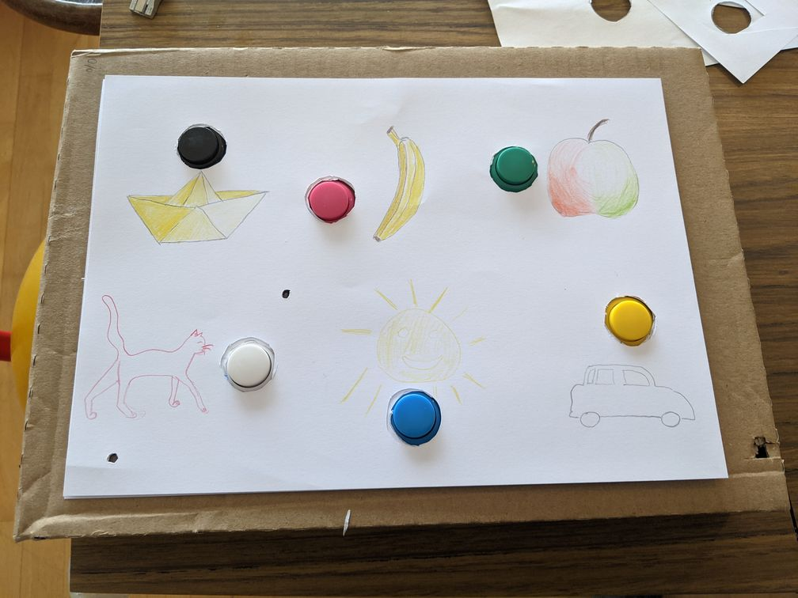
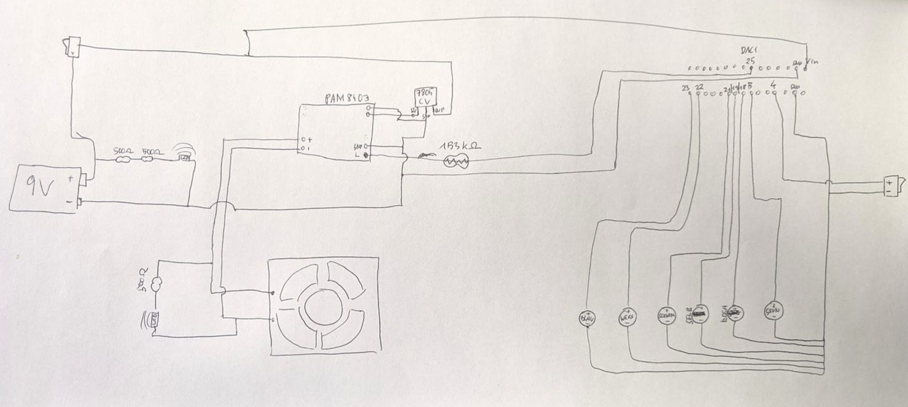

# svedishbox
Arduino source code for the swedish box project. 
A box which talks swedish words when pressing buttons. Very simple, I made it that my kids hear the swedish language before we moved to sweden. However, they learned a lot more with "Peppa Pig" (or Greta Gris, how it is called in swedish).

